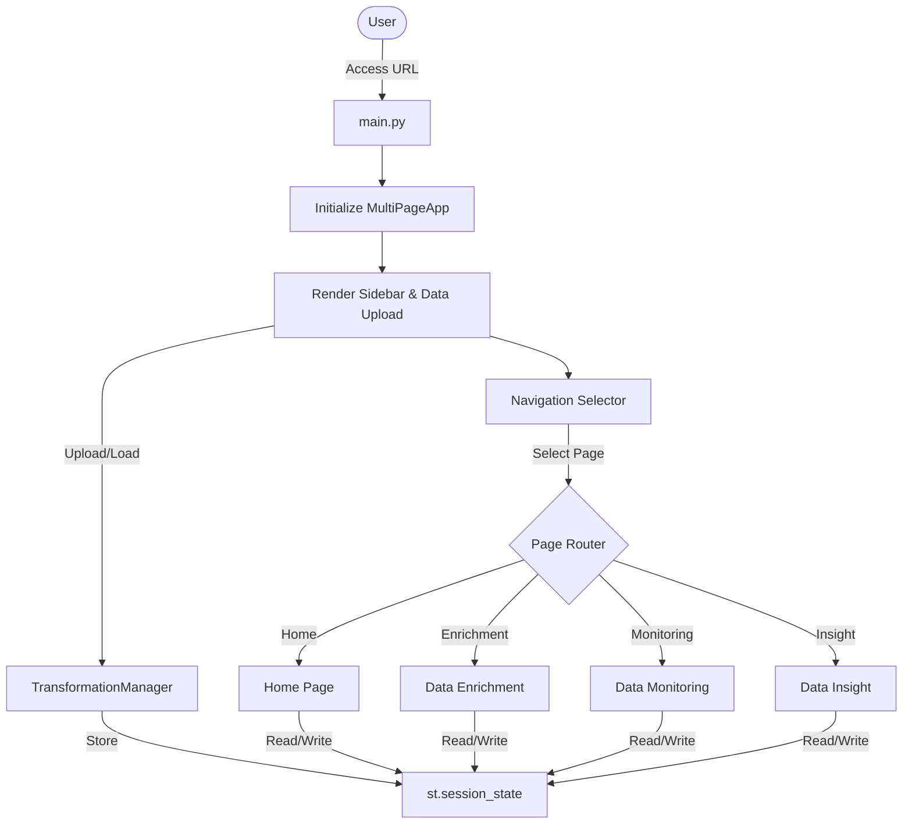
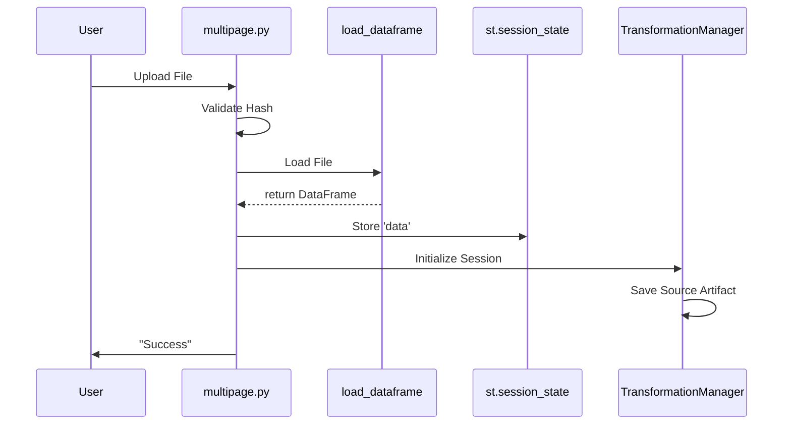

# Process Flow & Architecture

This document outlines the high-level execution flow and data movement within the Cohort Monitoring Package.

## 1. High-Level Architecture

The application is built on **Streamlit** and uses a centralized **Session State** to manage data across different pages.

## 2. Data Loading & Initialization Flow

The data loading process is critical as it sets up the `TransformationManager` and the main dataframe used throughout the app.

**File**: `utils/multipage.py` -> `handle_data_upload()`

1. **Upload**: User uploads a file (CSV/Excel) via the Sidebar.
2. **Validation**: File hash is generated (`get_file_hash`) to detect changes.
3. **Loading**: `load_dataframe()` handles parsing (with auto-encoding and separator detection).
4. **Session Setup**:
    * `st.session_state['data']` is populated.
    * `TransformationManager` is initialized.
    * Source artifact is saved to `data/traces/artifacts/`.
5. **Trace Initialization**: A new trace session is started to record future operations.

## 3. Key Feature Flows

### 3.1 Data Enrichment Flow

**File**: `app_pages/data_enrichment.py`

Allows users to merge external data or create new variables using formulas.

1. **Configuration**: User selects enrichment file or defines formula.
2. **Processing**:
    * **Enrichment**: `configure_enrichment` merges dataframes.
    * **Formula**: `evaluate_formula_safely` computes new columns using `pandas` and `numpy`.
3. **Persistence**:
    * Result saved to `transformed_df`.
    * `TransformationManager.add_step()` logs the operation.
    * Snapshot saved to disk.

### 3.2 Data Monitoring (Outlier Detection)

**File**: `app_pages/data_monitoring.py`

Detects and handles outliers using user-selected methods.

1. **Selection**: User selects columns and detection method (Z-Score, IQR, LOF, etc.).
2. **Detection**: `OutlierHandler` class runs the algorithm.
    * `detect_outliers_zscore()`
    * `detect_outliers_iqr()`
    * `detect_dbscan_outliers()`
3. **Handling**: User applies action (Clip, Remove, Tag).
4. **Update**:
    * `_apply_handling_strategy()` updates variables.
    * Changes recorded in `TransformationManager`.

### 3.3 Data Insight (Knowledge Graph)

**File**: `app_pages/data_insight.py`

Visualizes relationships between variables using a Knowledge Graph.

1. **Load Taxonomy**: `get_taxonomy_versions()` loads JSON metadata.
2. **Graph Construction**: `get_graph_data()` maps variables to Nodes and relationships to Edges.
3. **Repair**: `repair_taxonomy_links()` ensures consistency between taxonomy and formulas.
4. **Rendering**: `StreamlitGraphWidget` renders the interactive graph.

### 3.4 Documents Insight (RAG Workflow)

**Files**: `app_pages/document_insight.py`, `manage/rag_manager.py`

Implements Retrieval-Augmented Generation to query scientific documents.

1. **Ingestion**: User uploads PDF.
2. **Indexing**: `RAGManager.add_document()`:
    * Extracts text.
    * Chunks text.
    * Generates embeddings (HuggingFace).
    * Stores in Vector DB (ChromaDB).
3. **Retrieval**: `RAGManager.query()` finds relevant chunks based on user query.
4. **Generation**: LLM (OpenAI/Mistral) synthesizes answer using retrieved chunks.

### 3.5 Traceability & Reproduction

**Files**: `manage/transformation_manager.py`, `manage/trace_documenter.py`, `app_pages/reproduce_analysis.py`

Ensures all user actions are recorded and reproducible.

1. **Recording**: Every action (enrichment, outlier removal) calls `add_step()` on `TransformationManager`.
2. **Persistence**: Steps are saved to a JSON trace file in `data/traces/`.
3. **Documentation**: `TraceDocumenter` converts the JSON trace into a readable Word report (`.docx`).
4. **Reproduction**:
    * User uploads a Trace JSON in "Reproduce Analysis" page.
    * `ReproductionManager` replays the steps on the original dataset to recreate the final state.

## 4. Function Dependency Graph

A simplified view of how key modules interact.

* **`main.py`**
  * depends on `utils.multipage`
  * depends on `app_pages.*`

* **`app_pages.*`**
  * depend on `manage.db_manager` (Persistence)
  * depend on `manage.transformation_manager` (Traceability)
  * depend on `utils.data_analyzer` (Column typing)
  * depend on `utils.visualization_utils` (Plotting)

* **`manage.*`**
  * `TransformationManager` depends on `pandas`, `json`
  * `DBManager` depends on `duckdb`, `pandas`
